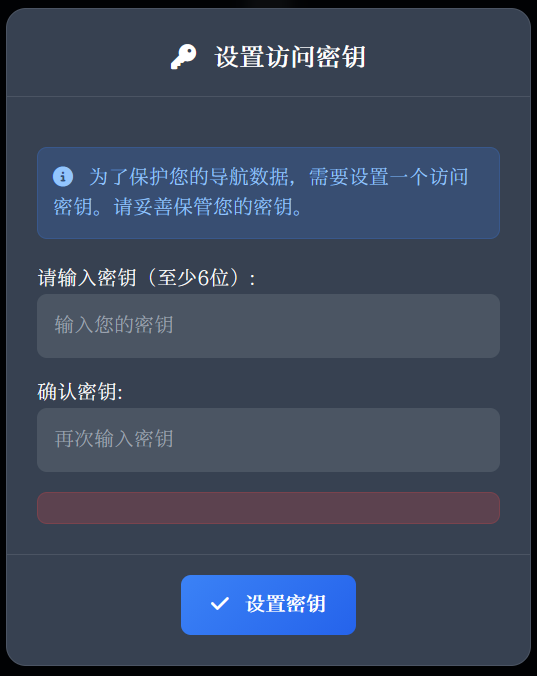
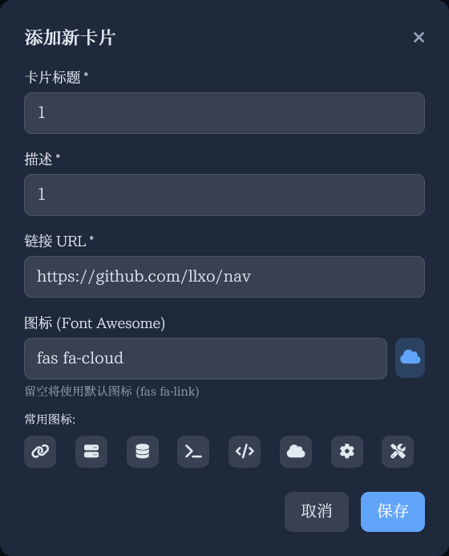
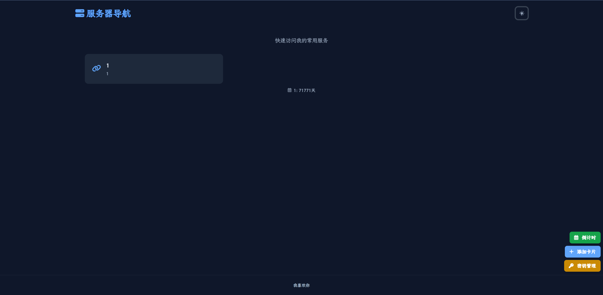

# 服务器导航 🚀

一个基于 Node.js + SQLite 的现代化服务器导航页面，支持书签管理、倒计时功能和用户身份验证。

## ✨ 特性

- 🔐 **用户身份验证** - 支持用户注册、登录和权限管理
- 📱 **响应式设计** - 完美适配桌面和移动设备
- 🌙 **深色模式** - 支持明暗主题切换
- 📚 **书签管理** - 添加、编辑、删除和排序书签
- 🎯 **拖拽排序** - 支持书签拖拽重新排序
- ⏰ **倒计时功能** - 设置和管理重要事件倒计时
- 🎨 **现代化UI** - 使用 Tailwind CSS 构建的美观界面
- 💾 **数据持久化** - 使用 SQLite 数据库存储数据
- 🐳 **Docker支持** - 提供完整的 Docker 部署方案

## 🛠️ 技术栈

### 后端
- **Node.js** - JavaScript 运行时
- **Express** - Web 框架
- **SQLite3** - 轻量级数据库
- **bcrypt** - 密码加密
- **jsonwebtoken** - JWT 身份验证
- **cors** - 跨域资源共享

### 前端
- **HTML5** - 标记语言
- **Tailwind CSS** - 样式框架
- **Vanilla JavaScript** - 原生 JavaScript
- **Font Awesome** - 图标库
- **SortableJS** - 拖拽排序

## 预览


| 设置密钥 | 添加卡片 |
| -------- | ---------- |
|  |  |



## 🚀 快速开始

### 环境要求

- Node.js 18.0+
- npm 8.0+
- 或 Docker 环境

### 本地开发

1. **克隆仓库**
   ```bash
   git clone https://github.com/llxo/nav.git
   cd nav
   ```

2. **安装依赖**
   ```bash
   npm install
   ```

3. **启动开发服务器**
   ```bash
   npm run dev
   ```

4. **设置环境变量**
   根据.env.example新建一个.env
   并配置JWT_SECRET

5. **访问应用**
   ```
   http://localhost:721
   ```

### 生产部署

1. **启动生产服务器**
   ```bash
   npm start
   ```

### Docker 部署

#### 使用 Docker Compose（推荐）

1. **克隆仓库**
   ```bash
   git clone https://github.com/llxo/nav.git
   cd nav
   ```

2. **设置环境变量**
   根据.env.example新建一个.env
   配置JWT_SECRET

3. **启动docker**
   ```
   docekr-compose up -d
   ```

4. **访问应用**
   ```
   http://localhost:721
   ```